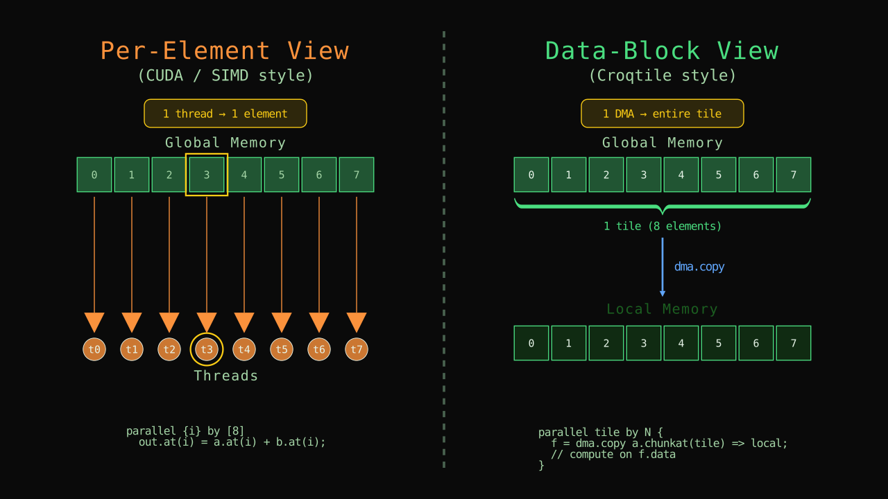
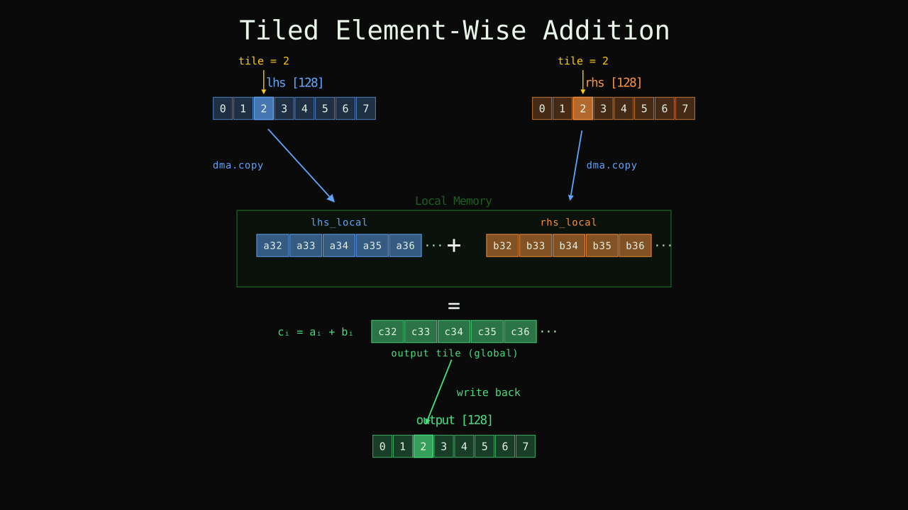

# Data Movement: From Elements to Data Blocks

Chapter 1 expressed computation at the level of individual elements: pick position `(i, j)`, read the two inputs, add, write the result. That is the natural way to think about SIMD-style programming — and it is exactly the mental model that most CUDA and GPU tutorials teach. You write a per-element kernel, launch one thread per element, and each thread does its own tiny job.

The trouble is that hardware does not actually work this way. A GPU does not fetch one 32-bit integer from memory at a time. It fetches contiguous blocks — 128 bytes, 256 bytes, sometimes more — in a single transaction, and it stages those blocks through a hierarchy of caches and on-chip buffers before any arithmetic touches them. There is a fundamental mismatch between the per-element programming model and the per-block hardware reality. Bridging that gap — thinking in blocks, managing memory levels, wiring up transfers — is the single biggest reason GPU programming is hard for newcomers.

Croktile is designed around this insight. Instead of forcing you to think element-by-element and then hope the compiler or hardware will figure out the block structure, Croktile gives you **data-block-level primitives**: you name a rectangular chunk of a tensor with `chunkat`, move it between memory levels with `dma.copy`, and then work on it in-place. The programming model matches what the hardware actually does.

This chapter rewrites Chapter 1's element-wise addition to use these block-level primitives. The math is identical — every element of `lhs` is still added to the corresponding element of `rhs` — but the code now explicitly describes which blocks of data move where, and the computation happens on whole tiles rather than individual scalars.



*Left: per-element view — each thread fetches one element individually. Right: data-block view — one DMA moves an entire tile at once.*

<details>
<summary>Animated version</summary>
<video controls style="max-width: 100%; border-radius: 8px; margin: 1em 0;">
  <source src="/croktile-tutorial/assets/videos/ch02/anim1_element_vs_block.mp4" type="video/mp4" />
</video>
</details>

## Tiled Element-Wise Addition

Here is the same addition, rewritten to move data in tiles of 16 elements. The inputs are 1D vectors of length 128 so the tiling arithmetic stays simple:

```choreo
__co__ s32 [128] tiled_add(s32 [128] lhs, s32 [128] rhs) {
  s32 [lhs.span] output;

  parallel tile by 8 {
    lhs_load = dma.copy lhs.chunkat(tile) => local;
    rhs_load = dma.copy rhs.chunkat(tile) => local;

    foreach i in [128 / #tile]
      output.at(tile # i) = lhs_load.data.at(i) + rhs_load.data.at(i);
  }

  return output;
}

int main() {
  auto lhs = choreo::make_spandata<choreo::s32>(128);
  auto rhs = choreo::make_spandata<choreo::s32>(128);
  lhs.fill_random(-10, 10);
  rhs.fill_random(-10, 10);

  auto res = tiled_add(lhs.view(), rhs.view());

  for (int i = 0; i < 128; ++i)
    choreo::choreo_assert(lhs[i] + rhs[i] == res[i], "values are not equal.");

  std::cout << "Test Passed\n" << std::endl;
}
```

Save it as `tiled_add.co`, compile and run:

```bash
croktile tiled_add.co -o tiled_add
./tiled_add
```

Same `Test Passed`. The result is identical to Chapter 1's version — the math has not changed, only how data moves through memory.



*Tiled addition for tile = 2: DMA loads both operand chunks into local memory, element-wise addition runs on the tile, and the result writes back to the output vector.*

<details>
<summary>Animated version</summary>
<video controls style="max-width: 100%; border-radius: 8px; margin: 1em 0;">
  <source src="/croktile-tutorial/assets/videos/ch02/anim2_tiled_add.mp4" type="video/mp4" />
</video>
</details>

Here is what is new.

## `chunkat`: Carving a Tensor into Tiles

```choreo
lhs.chunkat(tile)
```

`chunkat` divides a tensor into equal, non-overlapping rectangular pieces along each dimension. Here `lhs` has shape `[128]` and the `parallel` declares 8 tiles, so each chunk is `128 / 8 = 16` elements wide. The argument `tile` is the chunk index — which of the 8 pieces you want. When `tile` is 0, you get elements 0 through 15; when `tile` is 3, you get elements 48 through 63; and so on.

For a 2D tensor, `chunkat` takes one index per dimension:

```choreo
matrix.chunkat(row_tile, col_tile)
```

Each dimension is divided independently. If `matrix` has shape `[64, 128]` and you declare `parallel {r, c} by [4, 8]`, then `matrix.chunkat(r, c)` gives you a `[16, 16]` piece at tile position `(r, c)`. Croktile figures out the chunk size from the tensor shape and the number of tiles along each axis.

The key thing to remember: `chunkat` does not copy data. It is a **view** — a description of which rectangle of the original tensor you mean. The actual movement happens in `dma.copy`.


*A [64, 128] tensor divided into 4 × 8 tiles. `chunkat(1, 3)` selects the [16, 16] sub-tensor at row-tile 1, column-tile 3.*

<details>
<summary>Animated version</summary>
<video controls style="max-width: 100%; border-radius: 8px; margin: 1em 0;">
  <source src="/croktile-tutorial/assets/videos/ch02/anim3_chunkat.mp4" type="video/mp4" />
</video>
</details>

## `dma.copy`: Bulk Transfer Between Memory Levels

```choreo
lhs_load = dma.copy lhs.chunkat(tile) => local;
```

This copies the chunk selected by `chunkat(tile)` from wherever `lhs` lives (by default, global device memory) into `local` memory — fast, on-chip storage close to the compute units. The result, `lhs_load`, is a **DMA future**: a handle that represents the in-flight (or completed) transfer.

The `=> local` part is the **destination memory specifier**. Croktile has three levels:

| Specifier | What it means | Analogy |
|-----------|--------------|---------|
| `global` | Device-wide memory (large, slow) | DRAM |
| `shared` | Block-scoped on-chip memory (fast, visible to all threads in a block) | CUDA shared memory |
| `local` | Thread-private on-chip storage (fastest, private) | Registers or per-thread scratch |

For now the examples use `local` because each tile runs independently — there is no cross-tile cooperation, so thread-private storage is the natural choice. Chapter 3 will introduce `shared` when multiple threads need to read the same tile.

## Futures and `.data`

After `dma.copy`, the variable `lhs_load` is not a tensor — it is a **future** that tracks the transfer. To get at the actual data, you use `.data`:

```choreo
lhs_load.data.at(i)
```

`lhs_load.data` is a spanned tensor in local memory with the shape of the chunk that was copied. You index into it with `.at(i)` exactly like you indexed into `lhs` in Chapter 1 — except now you are reading from fast memory instead of global memory.

Why the indirection? Because in later chapters you will issue copies that run **asynchronously** — the hardware starts moving data while your program does other work. The future is what lets you refer to "the data that will be there when the transfer finishes" without blocking immediately. For now, the copies are synchronous and `.data` is always valid right after the `dma.copy` line, but the pattern is the same.

## The `#` Compose Operator

Look at the output indexing:

```choreo
output.at(tile # i)
```

The `#` operator composes a **tile index** `tile` with a **local offset** `i` to produce a **global index** into `output`. The rule is **outer # inner**: the higher-level index goes on the left, the element offset within that tile goes on the right. Since `tile` selects which chunk of 16 elements to work on, and `i` runs from 0 to 15 within that chunk, `tile # i` gives the position in the full 128-element vector: concretely `tile * 16 + i`.

You need `#` because `lhs_load.data.at(i)` uses a **local** index (position within the tile), but `output.at(...)` uses a **global** index (position in the full output tensor). The compose operator bridges the two coordinate systems. Read `tile # i` as "element `i` within tile `tile`."

This `#` operator appears in one dimension here. In Chapter 3, when tiling a 2D matrix with parallel indices `p` and `q`, the pattern is `output.at(p#m, q#n)` — same idea, just more axes.

## The `#` Extent Operator

In the inner loop:

```choreo
foreach i in [128 / #tile]
```

`#tile` means "the **extent** of the tile axis" — how many tiles there are along that dimension. Here `#tile` is 8 (because `parallel tile by 8` declared 8 tiles), so `128 / #tile` is 16 — the number of elements in each tile. This is the trip count of the inner loop: you visit every element position within one tile.

The `#` symbol does double duty in Croktile: before a name in an expression (`#tile`) it means the **extent** of that index; between two names (`tile # i`) it means **compose**. Context tells you which is which — `#` as extent always appears as a prefix, and `#` as compose always appears as an infix between two operands.

## `span(i)`: Picking One Dimension

Chapter 1 used `lhs.span` to copy the *entire* shape of an input. Sometimes you want just one dimension. `lhs.span(0)` gives the size along the first axis, `rhs.span(1)` gives the size along the second, and so on. This matters when your output has a different rank than your inputs — for example, a matmul where the output shape `[M, N]` comes from `lhs.span(0)` and `rhs.span(1)`:

```choreo
s32 [lhs.span(0), rhs.span(1)] output;
```

`span(i)` is not needed yet in this 1D example, but it becomes important the moment you tile 2D tensors.

## 2D Tiled Addition

The same pattern works on matrices. Here is a `[64, 128]` addition tiled into `[4, 8]` chunks of size `[16, 16]`:

```choreo
__co__ s32 [64, 128] tiled_add_2d(s32 [64, 128] lhs, s32 [64, 128] rhs) {
  s32 [lhs.span] output;

  parallel {tr, tc} by [4, 8] {
    lhs_load = dma.copy lhs.chunkat(tr, tc) => local;
    rhs_load = dma.copy rhs.chunkat(tr, tc) => local;

    foreach {i, j} in [64 / #tr, 128 / #tc]
      output.at(tr # i, tc # j) = lhs_load.data.at(i, j) + rhs_load.data.at(i, j);
  }

  return output;
}
```

Every construct generalizes naturally to higher dimensions: `chunkat(tr, tc)` takes two tile indices, `foreach {i, j}` introduces two inner indices, `tr # i` and `tc # j` compose along each axis (outer # inner), and `#tr` / `#tc` give the tile counts (4 and 8 respectively) so the inner loop bounds compute to `16` and `16`.

The host code is the same pattern as before — `make_spandata<choreo::s32>(64, 128)`, `.view()`, verify with nested loops.

## Memory Hierarchy: Where Data Lives

The examples used `=> local` for all copies. In practice, you choose the destination based on who needs access:

- **`local`** — only the thread that issued the `dma.copy` can see this data. Good when there is no sharing, or when each thread works on its own independent slice.
- **`shared`** — all threads in the same block can see this data. Essential when multiple threads collaborate on the same tile (which is the standard pattern for matmul and reductions). We will use `shared` in the next chapter.
- **`global`** — device-wide, largest and slowest. Input and output tensors start here; you copy pieces into `shared` or `local` for fast access, then copy results back.

The choice does not change the Croktile function's semantics — only performance. You could replace every `=> local` with `=> shared` and the program would still produce the same result, just with different speed characteristics.

## What Changed from Chapter 1

Nothing about the math changed. Every element of `lhs` is still added to the corresponding element of `rhs`. What changed is the **granularity** of memory access: instead of 128 individual reads and writes, we issue 8 bulk copies per input tensor, each moving 16 contiguous elements into fast memory. The compute loop then runs entirely on local data.

The new vocabulary:

| Syntax | Meaning |
|--------|---------|
| `dma.copy src => local` | Bulk-copy `src` into local (or `shared` / `global`) memory |
| `tensor.chunkat(i)` | View of the `i`-th equal chunk of `tensor` |
| `tensor.chunkat(i, j)` | View of chunk at position `(i, j)` in a 2D tiling |
| `future.data.at(...)` | Access the copied data through a DMA future |
| `tile # i` | Compose tile index `tile` with local offset `i` into a global index (outer # inner) |
| `#tile` | Extent (number of tiles) along the `tile` axis |
| `lhs.span(0)` | Size of `lhs` along its first dimension |
| `local` / `shared` / `global` | Memory level specifiers for DMA destinations |

All of these compose naturally with `parallel` and `.at()` from Chapter 1. The [next chapter](ch03-parallelism.md) goes deeper into `parallel` — mapping it to CUDA thread blocks, warps, and warpgroups — and uses everything from this chapter to build a tiled matrix multiply.
